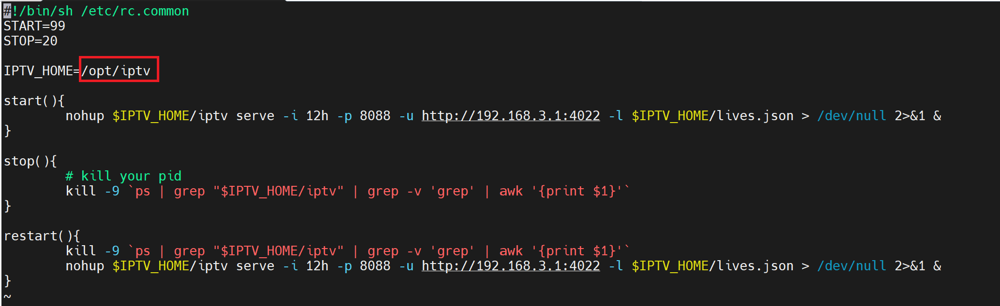
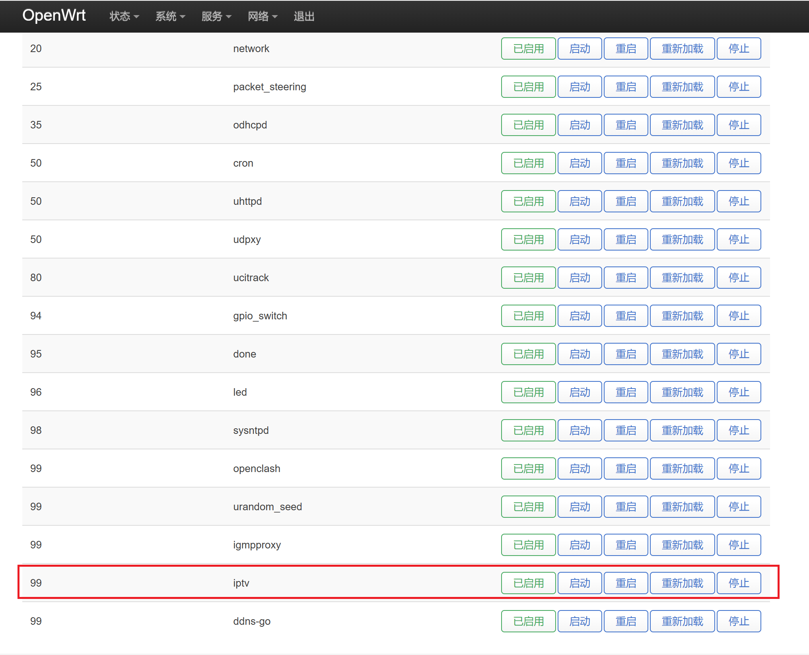

# OpenWrt自启动设置

## 步骤

1. 通过SSH客户端登录OpenWrt，执行以下命令安装依赖并下载自启动脚本。
    ```bash
    opkg update && opkg install coreutils-nohup
    cd /etc/init.d/
    curl -OJL https://raw.githubusercontent.com/super321/iptv-tool/main/scripts/iptv
    chmod 755 iptv
    ```

2. 根据自己的实际环境修改自启动脚本`iptv`，例如：IPTV工具的运行目录和启动命令。
   

3. 执行以下命令启用并立即启动自启动脚本。
    ```bash
    /etc/init.d/iptv enable
    /etc/init.d/iptv start
    ```

4. 在OpenWrt“启动项”界面，可查看自启动状态
   